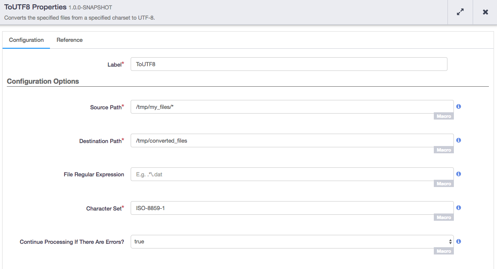

     

To UTF-8 Action Plugin
======================

The To UTF-8 Action is used to convert files created in other character sets
into UTF-8 format so that they can be processed using standard Hadoop Text Input Formats.
Due to [MAPREDUCE-232](https://issues.apache.org/jira/browse/MAPREDUCE-232), files created
in other charsets must be converted to UTF-8 before being processed. This plugin supports
any character set listed under ``java.nio`` in 
the [Java Supported Encodings Documentation](https://docs.oracle.com/javase/8/docs/technotes/guides/intl/encoding.doc.html).

Plugin Configuration
---------------------

| Configuration | Required | Default | Description |
| :------------ | :------: | :------ | :---------- |
| **Source Path** | **Y** | None | The full path of the file or directory that is to be converted. In the case of a directory, if fileRegex is set, then only files in the source directory matching the regex expression will be moved. Otherwise, all files in the directory will be moved. For example: `hdfs://hostname/tmp`. You can use globbing syntax here. |
| **Destination Path** | **Y** | None | The full path where the file or files are to be saved. If a directory is specified the files will be created in that directory. If the Source Path is a directory, it is assumed that Destination Path is also a directory. The new files will have ``.utf8`` appended to the end. Files with the same name will be overwritten. |
| **File Regular Expression** | **N** | None | Regular expression to filter the files in the source directory that will be moved. This is useful when the globbing syntax in the source directory is not precise enough for your files. |
| **Character Set** | **Y** | None| The name of the character set used to create the file. The complete list of supported character sets can be found in the [Java Supported Encodings Documentation](https://docs.oracle.com/javase/8/docs/technotes/guides/intl/encoding.doc.html). |
| **Continue Processing If There Are Errors?** | **Y** | false | Indicates if the pipeline should continue if processing the files fails. |

Usage Notes
-----------

This plugin can be very useful for converting sets of files to UTF-8 prior to processing them in MapReduce or Spark. Because this action runs as a single process prior to the MapReduce or Spark job, it can take a considerable amount of time to convert large files. If that is the case, you may be better off writing a custom Input format for handling that data.
 
The files are created in the destination folder with ``.utf8`` appended to them. Most likely, you will want to use the ``HDFSDelete`` action at the end of the pipeline to clean up these files.

When using the Wrangler tool, you will want to wrangle with the UTF-8 converted file to get the best results.

Getting Started
===============

Prerequisites
--------------
CDAP version 4.1.x or higher.

Building Plugins
----------------
You get started with To UTF-8 action plugin by building directly from the latest source code::

   git clone git@github.com:hydrator/to-utf8-action.git
   cd to-utf8-action
   mvn clean package

After the build completes, you will have a JAR for each plugin under each
``<plugin-name>/target/`` directory.

Deploying Plugins
-----------------
You can deploy a plugin using the CDAP CLI::

  > load artifact <target/plugin-jar> config-file <resources/plugin-config>

  > load artifact target/to-utf8-action-<version>.jar \
         config-file target/to-utf8-action-<version>.json

You can build without running tests: ``mvn clean install -DskipTests``

Mailing Lists
-------------
CDAP User Group and Development Discussions:

- `cdap-user@googlegroups.com <https://groups.google.com/d/forum/cdap-user>`__

The *cdap-user* mailing list is primarily for users using the product to develop
applications or building plugins for appplications. You can expect questions from
users, release announcements, and any other discussions that we think will be helpful
to the users.

IRC Channel
-----------
CDAP IRC Channel: #cdap on irc.freenode.net

License and Trademarks
======================

Copyright © 2017 Cask Data, Inc.

Licensed under the Apache License, Version 2.0 (the "License"); you may not use this file except
in compliance with the License. You may obtain a copy of the License at

http://www.apache.org/licenses/LICENSE-2.0

Unless required by applicable law or agreed to in writing, software distributed under the
License is distributed on an "AS IS" BASIS, WITHOUT WARRANTIES OR CONDITIONS OF ANY KIND,
either express or implied. See the License for the specific language governing permissions
and limitations under the License.

Cask is a trademark of Cask Data, Inc. All rights reserved.

Apache, Apache HBase, and HBase are trademarks of The Apache Software Foundation. Used with
permission. No endorsement by The Apache Software Foundation is implied by the use of these marks.
